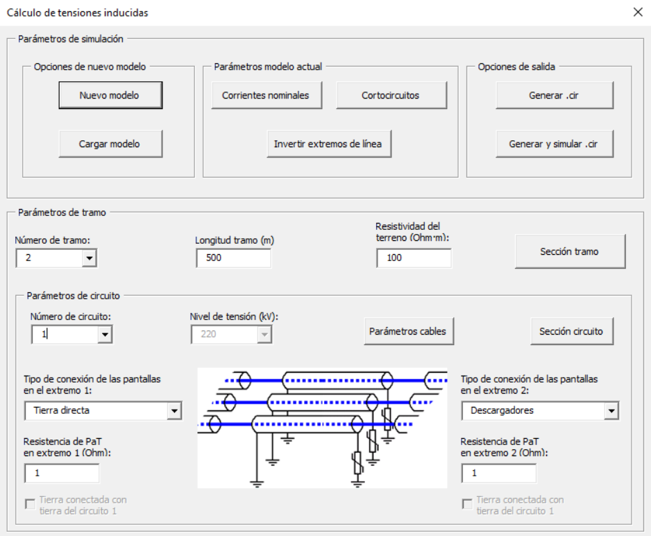

# Introducción

Los cables aislados de alta tensión presentan una pantalla envolvente de material conductor que aísla completamente el campo eléctrico, pero que al ser cortado por el campo magnético que generan las corrientes alternas, induce tensiones y/o corrientes en las citadas pantallas. Estas tensiones y corrientes deberán ser cuidadosamente calculadas, dado que influyen tanto en la capacidad de transporte de la línea como en el diseño de las protecciones a instalar. Además, dependiendo del tipo de conexión de las pantallas a tierra, se producirán corrientes que a su vez también inducirán tensiones en las pantallas próximas.

En el caso de que dos o más líneas discurran paralelas y cercanas la una a la otra, los campos magnéticos debidos a las corrientes de una afectarán a las tensiones inducidas en las pantallas de la otra y viceversa.

En este proyecto se modela matemáticamente y simulan las tensiones inducidas en las pantallas de cables aislados para cualquier tipo de caso y
configuración, con el objetivo de poder visualizar tanto magnitudes como ángulos de desfase entre ellas. Además, también se pueden desglosar las diferentes componentes de estas tensiones. De esta forma se puede visualizar, en tiempo de diseño, en qué medida afectan los diferentes parámetros (sección de los cables, resistencias de puesta a tierra, configuración de la conexión, longitudes de los tramos, etc.) a las citadas tensiones.

Dado que en líneas paralelas cercanas las corrientes de una línea inducen tensiones y/o corrientes en la otra, el modelo a generar es dinámico; es decir, el modelo para dos líneas paralelas no sale únicamente de replicar dos veces el modelo de una línea, ya que una línea se comporta diferente si tiene otra al lado, o si tiene dos, o tres, etc. Así pues, en el software desarrollado para este trabajo, este hecho es transparente para el usuario, que no deberá hacer mayor esfuerzo para ello que indicar que la simulación es de doble circuito, triple circuito, etc.

Para conseguir este objetivo se genera un modelo eléctrico que emula el funcionamiento de los diferentes casos a partir de los datos de la línea introducidos por el usuario. Automáticamente se genera un archivo de texto plano. Este texto es la descripción completa de un circuito electrónico en términos de resistencias, inductancias, condensadores, fuentes de corriente, etc. Esta descripción que se genera automáticamente está realizada en lenguaje SPICE, que es un estándar internacional para la descripción de hardware. Evidentemente, el texto ya incluye el acoplamiento entre los n circuitos a simular.

Una vez realizada esta tarea, dado que existen simuladores SPICE libres y gratuitos, se simula el circuito y de esta forma se tiene acceso a todos los datos buscados. Para ello en este proyecto se ha utilizado el software gratuito LT Spice IV (https://www.analog.com/en/design-center/design-tools-and-calculators.html). El programa está basado en líneas de transporte de energía eléctrica de tensiones mayores o iguales a 66 kV.

# Aplicación

El programa para el cálculo de tensiones inducidas en pantallas de cables subterráneos de alta tensión está desarrollado completamente en VBA para Excel. Lo único que es necesario para poder ejecutarlo, además de tener el Excel instalado, es haber instalado LT Spice. El entorno gráfico es autoexplicativo. La línea a simular se define por tramos. En cada tramo hay que indicar la descripción de los diferentes parámetros de cada circuito (longitud del tramo, sección del cable, resistividad del terreno, resistencia de puesta a tierra en cada extremo, tipo de conexión de las pantallas a tierra, etc.)

# Memoria

Finalmente, en el repositorio también se adjunta la memoria que fue presentada en su día. En ella, además de los contenidos teóricos, se describe con detalle el uso de la aplicación.
